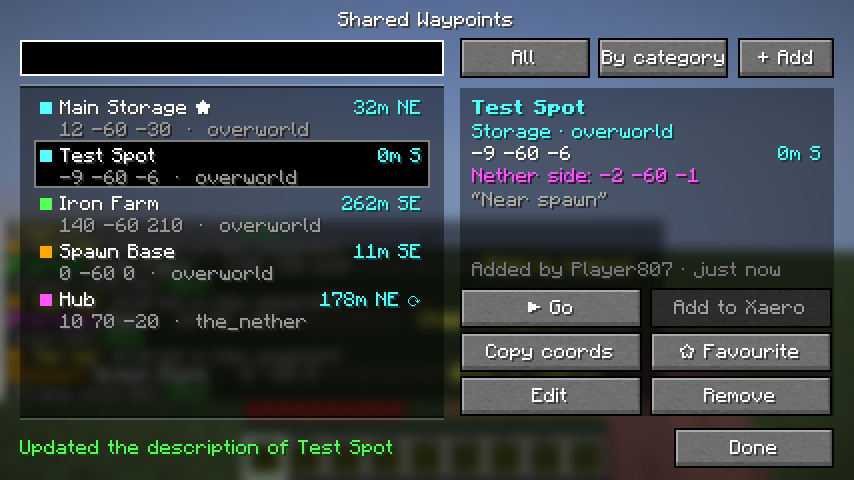
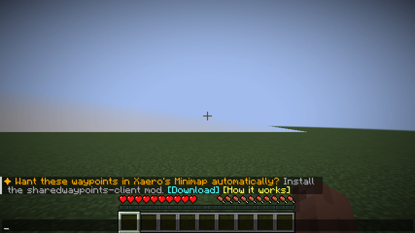

# SharedWaypoints

[](https://github.com/SteelAspect/sharedwaypoints/releases/latest)
[](https://github.com/SteelAspect/sharedwaypoints/actions/workflows/build.yml)


[](LICENSE)

**A shared waypoint list for your Fabric server.** Players browse waypoints in chat, add them to
**Xaero's Minimap** with a click, navigate to them with a **live on-screen compass**, follow **routes** stop by stop,
and see everything on your **BlueMap or squaremap** web map.

Only the server needs the mod. Players join with a vanilla client or with Xaero's Minimap, with nothing extra to
install. Players who want more install one optional jar, **sharedwaypoints-client**, and get:

- **Waypoint menu:** press **J**, or click **✦ Waypoints** in the top-right corner of the Esc menu.
- **Automatic Xaero sync:** with Xaero's Minimap installed, every shared waypoint appears in it by itself, in its
  own **"Shared"** waypoint set. It stays up to date as waypoints are added, edited and removed.

## The two jars

| Jar | Who installs it | What it does |
|---|---|---|
| `sharedwaypoints-server-<version>.jar` | **Server owners** (required). | Everything: `/cway`, chat buttons, [Add to Xaero], compass, routes, web maps, join summary, and syncing to players who have the client mod. |
| `sharedwaypoints-client-<version>.jar` | **Players, optional.** The only jar a player needs. | The waypoint menu (**J** or **✦ Waypoints** in the Esc menu), and, with Xaero's Minimap installed, keeps Xaero in sync with the server's shared waypoints in a "Shared" waypoint set. Your own waypoints are never touched. It works without Xaero too (menu only). |

Players without the client mod see exactly what they always did: chat lists with **[Add to Xaero]** buttons.

```
=== Shared Waypoints (3) ===
— Storage (1) —
[Storage] Main Storage — 120 64 -340 (overworld) [Add to Xaero] [Copy coords] [Go]
— Farms (1) —
[Farms] Iron-Farm — 100 64 200 (overworld) [Add to Xaero] [Copy coords] [Go]
— Portals (1) —
[Portals] Hub ★ — 10 70 -20 (the_nether) [Add to Xaero] [Copy coords] [Go]
```

## Features

**Browse and share**
- **Clickable waypoint list** in chat, grouped and coloured by category (storage, farms, bases, portals, other),
  with page buttons when it gets long.
- **[Add to Xaero]** opens Xaero's Minimap's own "add waypoint" screen, pre-filled for the right dimension and
  colour.
- **[Copy coords]** copies `X Y Z` to your clipboard.
- **Hover cards:** hover a name to see its distance and direction from you, description, who added it and when.
- **Search** by name, description or creator, and give waypoints short **descriptions**.
- **Announcements:** everyone online sees new waypoints as they're added, buttons included.
- **"3 new waypoints since you last played"** when you join, with the same buttons, so nobody misses new places.
- **Automatic Xaero's Minimap sync** for players with the optional client mod (see [Xaero's Minimap](#xaeros-minimap)).
- **★ Favourites** per player, marked in every list.
- **Project status:** mark a build **Planned**, **WIP**, **Done** or **Broken**, with a short note ("out of
  bonemeal"). `/cway projects broken` shows what needs fixing. The status shows in every list, in the menu, on the
  web maps, and as a `!` in Xaero's Minimap for broken builds. Anyone can set it by default, and the creator is told.
  Returning players see "⚠ 2 builds are marked Broken" when they join.

**Navigate**
- **[Go] / `/cway go`:** the boss bar becomes a compass. It shows an arrow relative to where you look, the
  distance, how far up or down, and a progress bar.
- **Beacon:** a particle column only you can see marks the destination. You get an **Arrived!** title and a sound
  when you reach it.
- **Overworld ↔ Nether aware:** the compass points you to the matching portal spot (÷8 / ×8), and the details
  view shows the portal-side coordinates. The portal spot's Y is always your own Y, never the other dimension's.
- **Portal guide:** look at a Nether portal and run `/cway portal`. Go through, and the matching spot on the other
  side (÷8 / ×8, same size and facing, at your height) is outlined for you with particles, with a compass bar
  pointing to it, until you build a portal there. It doesn't care which portal vanilla would link to, so
  chunk-loader portals close together are fine.
- **Near and nearest:** `/cway near` lists what's around you, closest first. `/cway nearest [category]`
  finds the closest one.
- **Teleport** for ops: a **[Teleport]** button and `/cway tp`.

**Routes**
- A **route** is a named list of waypoints to visit in order, e.g. a Nether highway tour or a round of your farms.
- **[Go]** on a route and the compass takes you to each stop in turn. When you arrive it shows "Stop 2/5" and moves
  on to the next stop by itself. **[Skip stop]** jumps ahead, and you can start from any stop.
- Anyone can create routes. Creators (and ops) add, remove and reorder stops, and rename, describe or delete the
  route. Deleting a waypoint removes it from every route; deleting a route keeps its waypoints.
- Routes show their stop count and total length (Nether legs counted in the Nether), and appear as gold lines on
  web maps.

**Optional client menu**
- Install `sharedwaypoints-client` and press **J** (or click **✦ Waypoints** in the Esc menu) on a server that
  runs SharedWaypoints: a full screen with
  search, category and ★ favourite filters, sorting by name or distance, and a details panel.
- Every action is a button: **Go / Stop**, **Add to Xaero** (opens Xaero's add screen directly), **Copy coords**,
  **Favourite**, **Edit** (name and description), **Remove**, **Teleport** (ops) and **+ Add** with your position
  pre-filled.
- A **Routes** screen lists every route and its stops. It has Start / Stop, Skip stop, **+ Stop** (pick a
  waypoint), **− Stop**, **↑ / ↓** to reorder, Edit and Delete.
- The server still decides everything, so permissions are the same as in chat. The menu updates live when
  anyone changes a waypoint. Players without the client mod keep using chat as before.
- The **[player guide](docs/PLAYER-GUIDE.md)** explains how to install the menu, what every button does, and how
  to use routes.
- The menu needs a matching mod version on both sides: 1.5.0 or newer on the client and on the server. If one side is
  older, J says so, and chat keeps working as normal.

  

**Web maps**
- **BlueMap and squaremap:** if either is installed, every waypoint shows up on the web map in a
  toggleable "Shared Waypoints" layer. Pins use the category colour, and clicking one shows its details.
  Routes are drawn as gold lines between their stops.
- **Always in sync:** adding, renaming or removing a waypoint or route updates the map straight away.

**For server owners**
- **Your own categories:** shops, mines, farms, whatever fits your server, each with its own colour (see
  [Configuration](#configuration)).
- **`/cway reload`** applies config changes and hand edits without a restart.
- **Permissions** through [fabric-permissions-api](https://github.com/lucko/fabric-permissions-api) (bundled), so it
  works with LuckPerms and falls back to vanilla op levels.
- **Players manage their own waypoints:** anyone can add, and creators can rename, describe or remove what they
  added.
- **Plain JSON storage** in `config/sharedwaypoints/`, saved safely after every change, plus a small config file.
- **Tab completion** everywhere: categories, names (with coordinates as the tooltip), coordinates and dimensions.

## Download and install

Both jars are on the **[latest release](https://github.com/SteelAspect/sharedwaypoints/releases/latest)**.

**Server owners**
1. Put `sharedwaypoints-server-<version>.jar` in your server's `mods/` folder, together with
   [Fabric API](https://modrinth.com/mod/fabric-api).
2. Start the server. Players don't need to install anything.

**Players (optional)**
- Put `sharedwaypoints-client-<version>.jar` and [Fabric API](https://modrinth.com/mod/fabric-api) in your
  `.minecraft/mods/` folder. That's the only SharedWaypoints jar a player needs.
- **The menu:** press **J**, or open the Esc menu and click **✦ Waypoints** (top right).
- **Automatic Xaero sync:** also have [Xaero's Minimap](https://modrinth.com/mod/xaeros-minimap) installed. The
  shared waypoints appear in Xaero's **"Shared"** set when you join.
- You don't need the server jar on your game. (It still works there, e.g. for singleplayer.)
  The [player guide](docs/PLAYER-GUIDE.md) has step-by-step instructions you can share.

The menu works on servers running SharedWaypoints 1.5.0 or newer; the Xaero sync needs 2.0.0 or newer.

| Requirement | Version |
|---|---|
| Minecraft | 1.21.11 |
| Fabric Loader | 0.19.5 or newer |
| Fabric API | any 1.21.11 build |
| Java | 21 |
| Xaero's Minimap (client mod only) | 26.5.0 for Fabric 1.21.11 (tested) |

The mod also works in singleplayer and LAN worlds.

## Commands

| Command | What it does |
|---|---|
| `/cway [page <n>]` | List all waypoints, grouped by category |
| `/cway <category> [page]` | List one category, e.g. `storage` (see `/cway categories`) |
| `/cway categories` | Categories with their counts and Xaero colours |
| `/cway info <name>` | Details, portal-side coordinates, distance and all buttons |
| `/cway search <text>` | Search names, descriptions, creators and status notes |
| `/cway near [radius]` | Waypoints around you, closest first (default 512 blocks) |
| `/cway nearest [category]` | The closest waypoint |
| `/cway go <name>` | Start compass navigation |
| `/cway stop` | Stop navigating |
| `/cway favorite <name>` | Add or remove a ★ favourite |
| `/cway favorites` | List your favourites |
| `/cway add <name> <category> [x y z] [dimension]` | Add a waypoint at your position, or at the given coordinates |
| `/cway rename <old> <new>` | Rename a waypoint |
| `/cway describe <name> [text]` | Set a description (max 120 characters). Leave the text out to clear it |
| `/cway remove <name>` | Remove a waypoint |
| `/cway status <name>` | Show its project status, with buttons to change it |
| `/cway status <name> <planned\|wip\|done\|broken> [note]` | Set the status, with an optional note (max 80 characters) |
| `/cway status <name> clear` | Remove the status |
| `/cway projects [status]` | Everything with a status, broken first, or only one status, e.g. `/cway projects broken` |
| `/cway tp <name>` | Teleport to a waypoint (ops) |
| `/cway route [list]` | List routes with their stop count and length |
| `/cway route info <route>` | A route's numbered stops, with buttons |
| `/cway route go <route> [stop]` | Follow a route, optionally starting at a later stop |
| `/cway route skip` | Go straight to the next stop |
| `/cway route create <name>` | Create an empty route |
| `/cway route add <route> <waypoint>` | Add a waypoint as the last stop (up to 64 stops) |
| `/cway route drop <route> <stop>` | Remove stop number *n* (the waypoint stays) |
| `/cway route move <route> <from> <to>` | Move a stop to another position |
| `/cway route rename <old> <new>` | Rename a route |
| `/cway route describe <route> [text]` | Set or clear a route's description |
| `/cway route delete <route>` | Delete a route (its waypoints stay) |
| `/cway reload` | Reload `config.json`, waypoints and favourites from disk (ops) |
| `/cway xaero <name>` | Send the Xaero share message (what **[Add to Xaero]** runs) |
| `/cway sync` | How to get the automatic Xaero's Minimap sync, or whether you already have it |
| `/cway portal` | Look at a Nether portal: its matching spot on the other side is highlighted for you (30 min, or until built) |
| `/cway portal stop` | Stop the portal guide |

- Put names with spaces in quotes: `/cway add "Main Storage" storage`. Names are 1–32 characters (Xaero's limit)
  and unique regardless of case.
- Coordinates use normal command syntax, including `~ ~ ~`.
- Tip: `/execute as @a run waypoints go "Event"` points everyone's compass at a waypoint.

## Permissions

With a permissions mod such as LuckPerms the nodes decide. Without one, these defaults apply:

| Node | Default |
|---|---|
| `sharedwaypoints.view` | everyone: list, search, info, navigate, follow routes, favourites, Xaero |
| `sharedwaypoints.add` | everyone |
| `sharedwaypoints.route` | everyone: create routes |
| `sharedwaypoints.edit` | op level 2, and creators can always rename or describe their own waypoints and change their own routes |
| `sharedwaypoints.remove` | op level 2, and creators can always remove their own waypoints and routes |
| `sharedwaypoints.status` | everyone: set or clear a waypoint's project status. Creators (and `edit`) can always set their own |
| `sharedwaypoints.teleport` | op level 2 |
| `sharedwaypoints.reload` | op level 2 |

## Configuration

`config/sharedwaypoints/config.json` is created on first start:

```json
{
  "announceNewWaypoints": true,
  "joinSummary": true,
  "syncToClientMod": true,
  "clientModTip": true,
  "clientModUrl": "https://github.com/SteelAspect/sharedwaypoints/releases/latest",
  "navigationParticles": true,
  "arrivalRadius": 6,
  "pageSize": 8,
  "nearRadius": 512,
  "webMapMarkers": true,
  "webMapLayerName": "Shared Waypoints",
  "categories": [
    { "id": "storage", "name": "Storage", "color": "aqua" },
    { "id": "farms", "name": "Farms", "color": "green" },
    { "id": "bases", "name": "Bases", "color": "gold" },
    { "id": "portals", "name": "Portals", "color": "light_purple" },
    { "id": "other", "name": "Other", "color": "white" }
  ]
}
```

| Option | Meaning |
|---|---|
| `announceNewWaypoints` | Live broadcast: tell everyone online when a waypoint is added, with [Add to Xaero] |
| `joinSummary` | On join, list the waypoints added since the player last played |
| `syncToClientMod` | Keep players who have sharedwaypoints-client in sync (their Xaero's Minimap). Off: they get chat buttons like everyone else |
| `clientModTip` | On their first join, tell players without sharedwaypoints-client how to get the Xaero sync (once per player) |
| `clientModUrl` | Where **[Download]** in that tip and in `/cway sync` points, e.g. your Discord or website. Empty: no link, players are told to ask an admin |
| `navigationParticles` | Show the particle beacon while navigating |
| `arrivalRadius` | Distance in blocks that counts as "arrived" (1–64) |
| `pageSize` | Waypoints per page (3–30) |
| `nearRadius` | Default radius for `/cway near` |
| `webMapMarkers` | Show waypoints on BlueMap / squaremap when installed |
| `webMapLayerName` | Name of the layer on the web map |
| `categories` | Your categories, in the order they're listed |

Each category has an `id` (one lower-case word, used in commands), a `name` shown in chat, and a `color`. The
colour is one of the 16 chat colours: `black`, `dark_blue`, `dark_green`, `dark_aqua`, `dark_red`,
`dark_purple`, `gold`, `gray`, `dark_gray`, `blue`, `green`, `aqua`, `red`, `light_purple`, `yellow` or
`white`. The same colour is used in chat, on the boss-bar compass (closest match), in Xaero's Minimap and on web
maps.

If you remove a category, its waypoints keep it and show up in gray until you add it back or move them.
Invalid entries are skipped with a warning in the server log.

Apply changes with `/cway reload`, or restart the server.

## Data files

Waypoints are stored in `config/sharedwaypoints/waypoints.json` and saved after every change:

```json
{
  "version": 2,
  "waypoints": [
    {
      "id": "3f1c2b8e-6a0d-4e53-9d7c-2b1f6e4a9c10",
      "name": "Main Storage",
      "category": "storage",
      "x": 120,
      "y": 64,
      "z": -340,
      "dimension": "minecraft:overworld",
      "description": "Sorted chests, bring shulkers",
      "creatorUuid": "8667ba71-b85a-4004-af54-457a9734eed7",
      "creatorName": "Steve",
      "created": "2026-09-29T12:00:00Z",
      "status": {
        "state": "broken",
        "note": "Out of bonemeal",
        "setByUuid": "8667ba71-b85a-4004-af54-457a9734eed7",
        "setByName": "Steve",
        "setAt": "2026-10-02T17:30:00Z"
      }
    }
  ],
  "lastSeen": {
    "8667ba71-b85a-4004-af54-457a9734eed7": "2026-09-30T18:42:07.512Z"
  }
}
```

- `status` is optional: waypoints without a project status don't have it. `state` is `planned`, `wip`, `done` or
  `broken`; an unknown state is dropped on load.
- `lastSeen` records when each player (by UUID) was last online, for the join summary. It's updated when players
  join and leave.
- You can edit the file by hand while the server is stopped. An unknown `category` becomes `other`, and broken
  entries are skipped with a warning.
- If the file can't be read at all, it's kept as `waypoints.json.broken-<time>` rather than overwritten.
- Favourites are stored per player in `favorites.json`.
- Routes are stored in `routes.json`, with each stop as a waypoint `id`:

```json
{
  "version": 1,
  "routes": [
    {
      "id": "9b2e41f0-3c55-4a1e-8d7f-0f4a6c1d2e33",
      "name": "Farm Run",
      "stops": ["3f1c2b8e-6a0d-4e53-9d7c-2b1f6e4a9c10", "7d0e5a92-1b4f-4c3a-9e2d-5f6a7b8c9d01"],
      "description": "Collect everything before the raid",
      "creatorUuid": "8667ba71-b85a-4004-af54-457a9734eed7",
      "creatorName": "Steve",
      "created": "2026-09-30T12:00:00Z"
    }
  ]
}
```

## Xaero's Minimap

There are two ways shared waypoints get into Xaero's Minimap.

### Automatic sync (optional client mod)

With **sharedwaypoints-client** installed (next to Xaero's Minimap), joining a server that runs SharedWaypoints 2.0+
fills a waypoint set called **"Shared"** in Xaero:

- every shared waypoint, in the right dimension, with its category colour and Xaero initials;
- updated live when anyone adds, renames, describes, recategorises or removes a waypoint;
- **reconciled on join**: the set is made to match the server exactly, so waypoints removed while you were away
  disappear too;
- your own waypoints and sets are never read or changed. Only the "Shared" set belongs to the mod (so don't
  name one of your own sets "Shared").

**How players find out:** players without the client mod get one line in chat on their first join, with
**[Download]** and **[How it works]**. Players who have the client mod but no (or an unsupported) Xaero's Minimap
are told a few seconds later to install it, with a link; a client mod of a different version is told to update.
`/cway sync` shows the steps any time, or tells a player the sync is already on for them. Turn the tip off with `clientModTip`, and point **[Download]** at your own page with
`clientModUrl`.



**Where are they?** By default Xaero only shows the *selected* waypoint set. Pick **Shared** in Xaero's waypoint
menu, or turn on **Render All WP Sets** in Xaero's settings to see shared and personal waypoints together. The
mod reminds you once per game.

Hiding (disabling) a shared waypoint in Xaero is kept across updates. Other edits made in Xaero to the "Shared"
set are overwritten; change waypoints with `/cway` instead.

**Tested version:** Xaero's Minimap **26.5.0 for Fabric 1.21.11** (`xaerominimap-fabric-1.21.11-26.5.0.jar`,
which bundles XaeroLib 1.7.3).

**Known limitation:** Xaero has no official API for adding waypoints, so the client mod uses Xaero's internal
classes. A future Xaero update may rename them. If that happens, the client mod logs one warning ("isn't
supported" / "Stopped syncing"), sync switches off, and everything else keeps working, including the chat
buttons. A client mod update then fixes it. Everything Xaero-specific is in one class, `XaeroBridge`. If Xaero
isn't installed at all, the client mod logs one line and only the sync is off: the waypoint menu, the J key and
the Esc menu button still work.

**Big lists:** the full list is sent in parts (1000 waypoints, then the rest one by one), so even servers with
many thousands of waypoints stay within Minecraft's packet limits.

### [Add to Xaero] (everyone, no client mod)

**[Add to Xaero]** makes the server send Xaero's standard waypoint-share message:

```
xaero-waypoint:Main Storage:M:120:64:-340:11:false:0:Internal-overworld-waypoints
```

Xaero's Minimap shows it as *Server shared a waypoint called "Main Storage" from overworld! **[Add]***. Clicking
**[Add]** opens Xaero's add-waypoint screen. This was checked against Xaero's Minimap 26.5.0 for 1.21.11. Category
colours map to the matching Xaero colours: storage aqua, farms green, bases gold, portals purple, other white.
Players without Xaero just see the raw line. See [docs/DEVELOPMENT.md](docs/DEVELOPMENT.md#xaeros-minimap-format)
for how the format was verified.

## Web maps

With [BlueMap](https://modrinth.com/plugin/bluemap) or [squaremap](https://modrinth.com/plugin/squaremap)
installed, a **Shared Waypoints** layer appears on every map. Each waypoint is a pin in its category colour, and
clicking it shows the name, category, coordinates, description and creator. Nothing needs setting up; turn it off
with `"webMapMarkers": false`. Tested against BlueMap 5.16 and squaremap 1.3.12 for 1.21.11.

## Building from source

```bash
./gradlew build
```

This builds both jars: `server/build/libs/sharedwaypoints-server-<version>.jar` and
`client/build/libs/sharedwaypoints-client-<version>.jar`. On any branch other than `main` they're named `…-dev-…`. See [docs/DEVELOPMENT.md](docs/DEVELOPMENT.md) for tests, the release process and
how the code is organised. The [changelog](CHANGELOG.md) lists what changed in each version.

## License

[MIT](LICENSE) © 2026 SteelAspect
