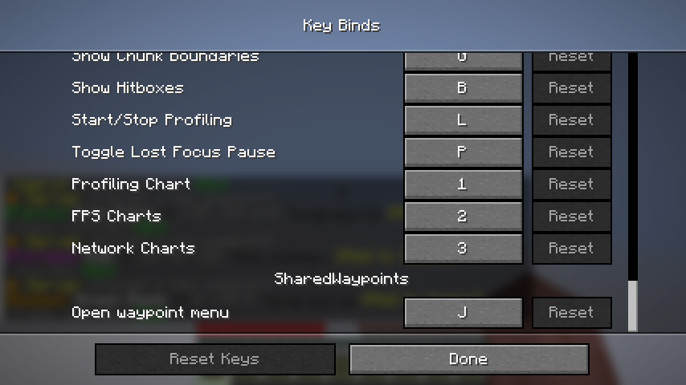
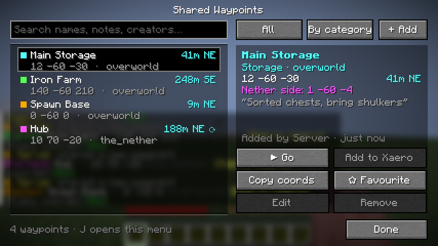
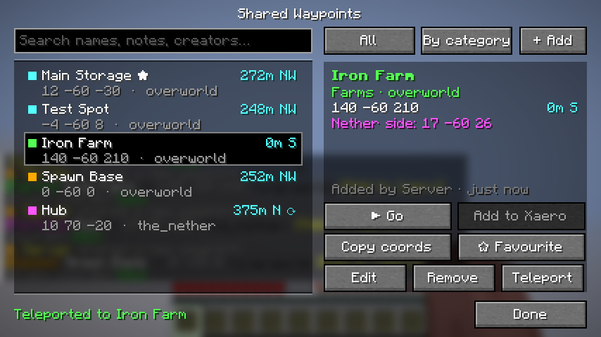
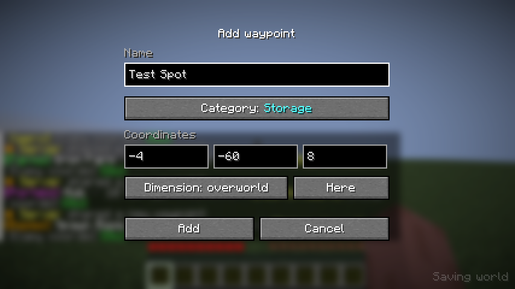
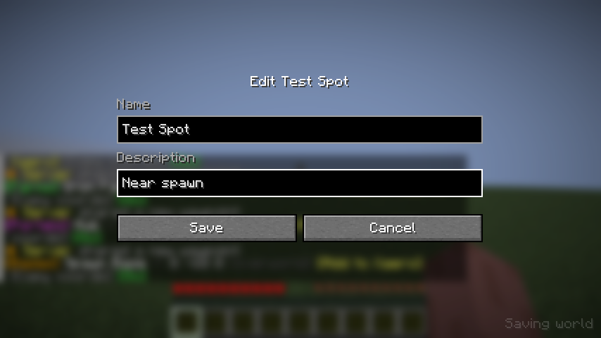
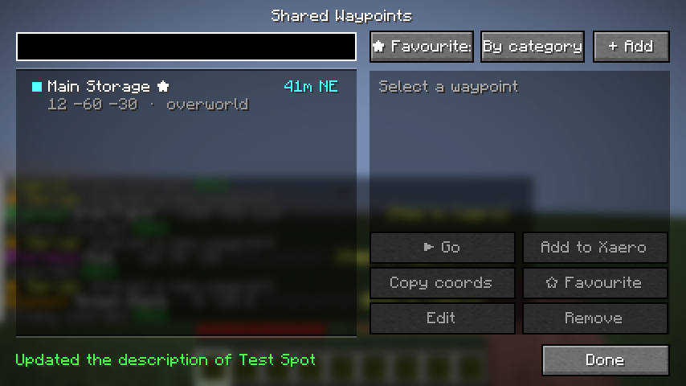

# Player guide

SharedWaypoints is a list of waypoints that everyone on the server shares. You can use it in two ways:

- **In chat.** This works for everyone and needs nothing installed: type `/waypoints` and click the buttons.
- **With the waypoint menu.** Install the mod on your own game too and press **J**. You get one screen with
  everything on buttons.

You don't need the menu. It's just quicker than typing commands.

## Installing the menu

You need Minecraft **1.21.11** with **Fabric**.

1. Install [Fabric Loader](https://fabricmc.net/use/installer/) for 1.21.11, if you haven't already.
2. Put these two files in your `.minecraft/mods/` folder:
   - [Fabric API](https://modrinth.com/mod/fabric-api) for 1.21.11
   - `sharedwaypoints-<version>.jar`, the same file the server uses (ask your server admin, or download it from
     the latest release)
3. Start Minecraft with the Fabric profile and join the server.
4. Press **J**.

On a server without SharedWaypoints, **J** just shows "SharedWaypoints isn't installed on this server".

To use a different key, go to **Options → Controls → Key Binds**. The setting is at the bottom, under
**SharedWaypoints**.

## The menu

**Left: the list.** Each waypoint shows its category colour, name, coordinates and dimension. On the right is how
far away it is and in which direction. A ⟳ means it's in another dimension, so the distance is the portal-side
distance.

**Top bar.**
- **Search** by name, description or who added it.
- **All / ★ Favourites / a category:** click to cycle through the filters.
- **By category / By name / By distance:** click to change the sort order.
- **+ Add:** add a new waypoint.

**Right: the selected waypoint.** You see its coordinates, the matching Nether or Overworld coordinates, its
description, and who added it and when.

## Buttons

| Button | What it does |
|---|---|
| **▶ Go** / **■ Stop** | Turns the boss bar into a compass pointing at the waypoint. You get an "Arrived!" title when you reach it. |
| **Add to Xaero** | Opens Xaero's Minimap's add-waypoint screen with everything filled in. Only works if you have Xaero's Minimap installed. |
| **Copy coords** | Copies `X Y Z` to your clipboard. |
| **☆ Favourite** | Marks it with ★ just for you. Use the ★ Favourites filter to see only yours. |
| **Edit** | Change the name or description. Available for waypoints you added (and for admins). |
| **Remove** | Deletes it for everyone, after asking you first. Available for waypoints you added (and for admins). |
| **Teleport** | Only shown to server admins. |

A greyed-out button means you aren't allowed to use it; hover it to see why. The line at the bottom left shows
the server's answer to your last action, e.g. "Teleported to Iron Farm".

## Adding and editing

**+ Add** opens a form with your current position already filled in. Type a name, click **Category** to change
it, and press **Add**. **Here** resets the coordinates to where you're standing. Everyone on the server sees the
new waypoint straight away.

**Edit** changes the name and the description (a short note such as "bring shulkers").

## Favourites

Favourites are per player: yours don't change what anyone else sees.

## Good to know

- The server decides everything. The menu can only do what you're allowed to do with commands.
- The list updates by itself when anyone adds, renames or removes a waypoint.
- Everything in the menu also works in chat. See the [command list](../README.md#commands).
