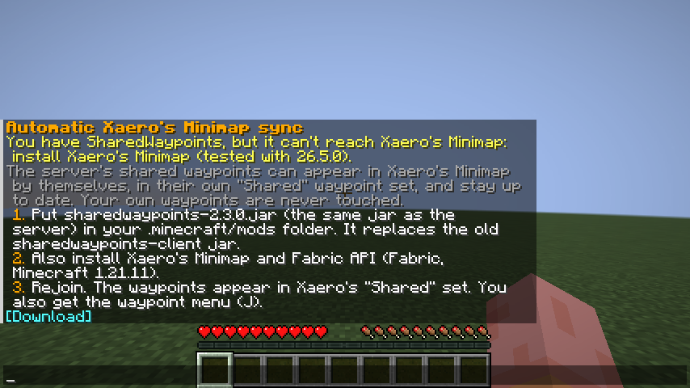
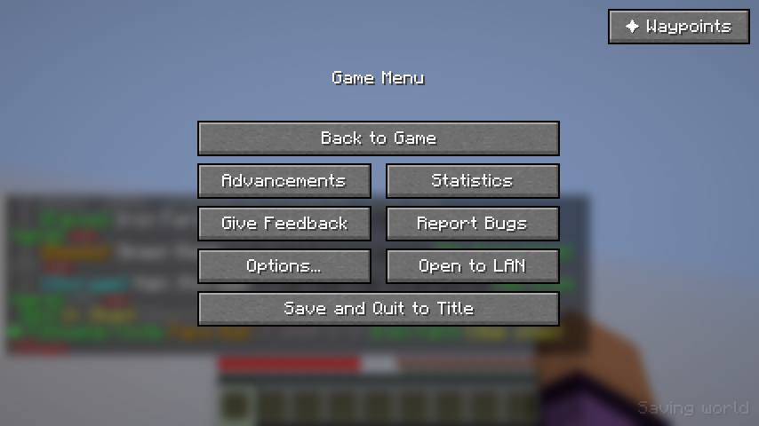
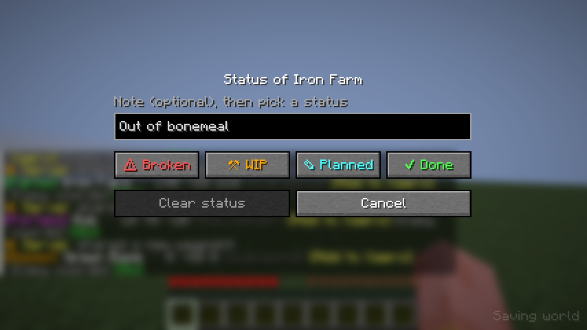
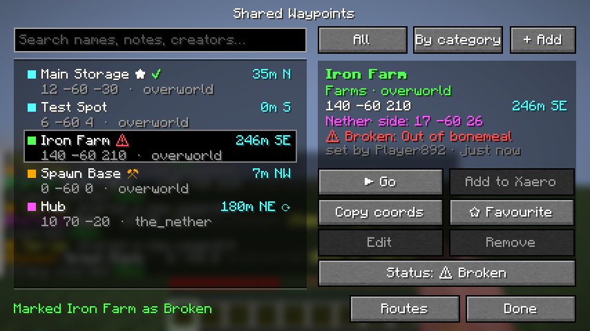
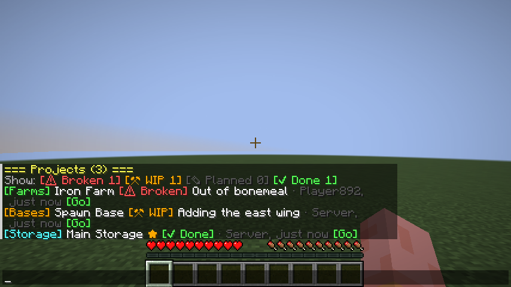
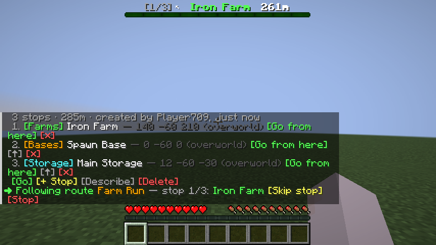
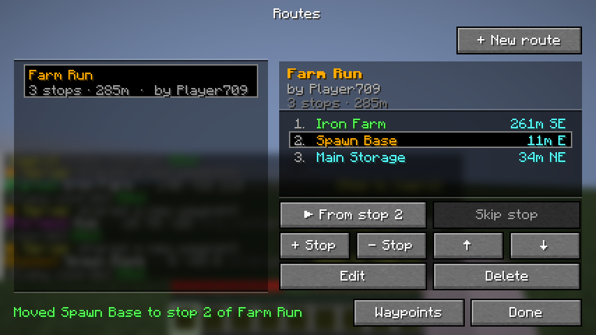
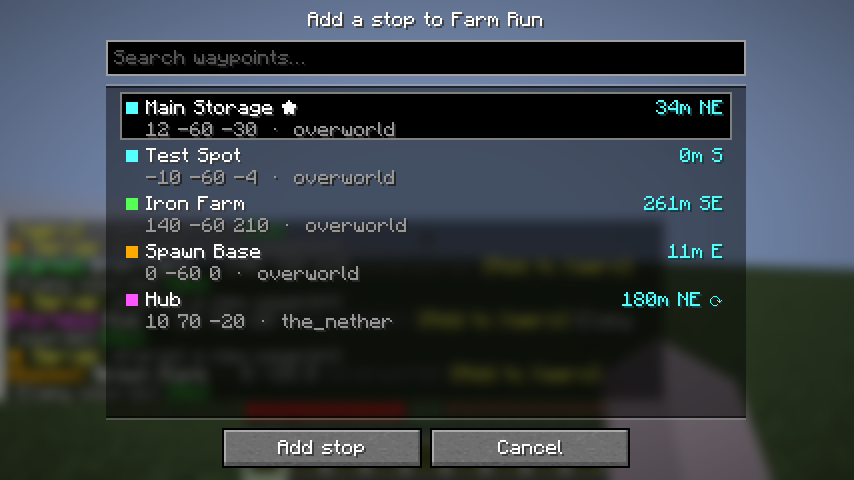
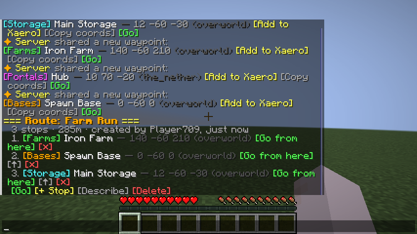
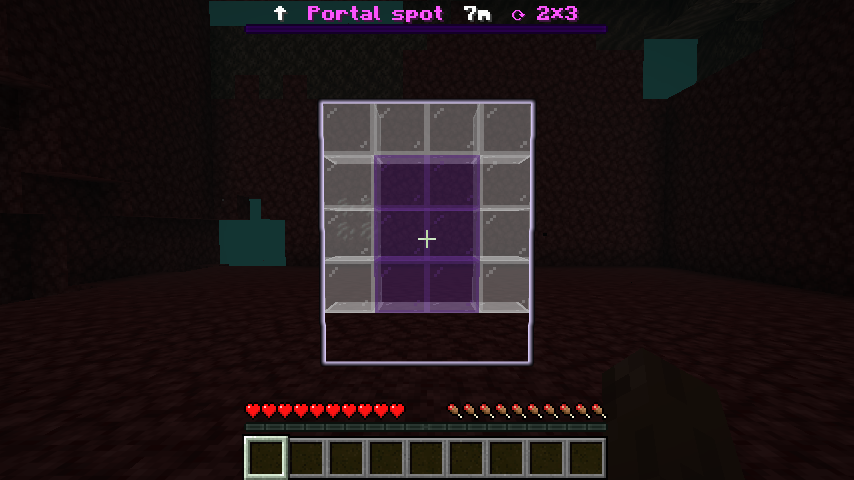

# Player guide

SharedWaypoints is a list of waypoints that everyone on the server shares. You can use it in two ways:

- **In chat.** This works for everyone and needs nothing installed: type `/cway` and click the buttons.
- **With the waypoint menu.** Put the SharedWaypoints jar (the same one the server uses) on your own game and
  press **J**, or click
  **✦ Waypoints** in the Esc menu. You get one screen with everything on buttons.

You don't need the menu. It's just quicker than typing commands.

## Automatic Xaero's Minimap sync (optional)

If you use **Xaero's Minimap**, you can have the server's shared waypoints appear in it automatically. The first
time you join, the server tells you how in chat. Type `/cway sync` to see the steps again, or to check it's
working.

1. Put `sharedwaypoints-<version>.jar` in your `.minecraft/mods/` folder, next to Xaero's Minimap and
   Fabric API. It's the same jar the server uses, and the same jar that gives you the menu below.
2. Join the server. The shared waypoints appear in a waypoint set called **"Shared"**. They stay up to date when
   anyone adds, changes or removes one, and the set is refreshed every time you join.
3. Xaero only shows the selected set. Pick **Shared** in Xaero's waypoint menu, or turn on **Render All WP Sets**
   in Xaero's settings to see shared and personal waypoints together.

Your own waypoints are never touched. Without the mod on your game, use the **[Add to Xaero]** buttons in chat as
before. Without Xaero's Minimap, the mod still gives you the menu; the server tells you once how to add Xaero.

## Installing the menu

You need Minecraft **1.21.11** with **Fabric**.

1. Install [Fabric Loader](https://fabricmc.net/use/installer/) for 1.21.11, if you haven't already.
2. Put these two files in your `.minecraft/mods/` folder:
   - [Fabric API](https://modrinth.com/mod/fabric-api) for 1.21.11
   - `sharedwaypoints-<version>.jar`, the same jar the server uses (ask your server admin, or download it from the
     latest release).
   - Had the old `sharedwaypoints-client` jar? Take it out: the new jar replaces it, and Fabric won't start with
     both.
3. Start Minecraft with the Fabric profile and join the server.
4. Press **J**. Or press **Esc** and click **✦ Waypoints** in the top-right corner, if you'd rather not use a key.

On a server without SharedWaypoints, **J** just shows "SharedWaypoints isn't installed on this server".

To use a different key, go to **Options → Controls → Key Binds**. The setting is at the bottom, under
**SharedWaypoints**.

## The menu

**Left: the list.** Each waypoint shows its category colour, name, coordinates and dimension. On the right is how
far away it is and in which direction. A ⟳ means it's in another dimension, so the distance is the portal-side
distance.

**Top bar.**
- **Search** by name, description or who added it.
- **All / ★ Favourites / Projects / a status / a category:** click to cycle through the filters. **Projects**
  shows everything with a status; **⚠ Broken** only what's broken.
- **By category / By name / By distance:** click to change the sort order.
- **+ Add:** add a new waypoint.

**Right: the selected waypoint.** You see its coordinates, the matching Nether or Overworld coordinates (at your own
height), its
project status (if it has one), its description, and who added it and when.

**Bottom right:** **Routes** opens the [routes screen](#routes), and **Done** closes the menu.

## Buttons

| Button | What it does |
|---|---|
| **▶ Go** / **■ Stop** | Turns the boss bar into a compass pointing at the waypoint. You get an "Arrived!" title when you reach it. |
| **Add to Xaero** | Opens Xaero's Minimap's add-waypoint screen with everything filled in. Only works if you have Xaero's Minimap installed. |
| **Copy coords** | Copies `X Y Z` to your clipboard. |
| **☆ Favourite** | Marks it with ★ just for you. Use the ★ Favourites filter to see only yours. |
| **Edit** | Change the name or description. Available for waypoints you added (and for admins). |
| **Remove** | Deletes it for everyone, after asking you first. Available for waypoints you added (and for admins). |
| **Teleport** | Only shown to server admins. |
| **Set status…** / **Status: …** | Mark it Planned, WIP, Done or Broken, with a note. See [Project status](#project-status). |

A greyed-out button means you aren't allowed to use it; hover it to see why. The line at the bottom left shows
the server's answer to your last action, e.g. "Teleported to Iron Farm".

## Adding and editing

**+ Add** opens a form with your current position already filled in. Type a name, click **Category** to change
it, and press **Add**. **Here** resets the coordinates to where you're standing. Everyone on the server sees the
new waypoint straight away.

**Edit** changes the name and the description (a short note such as "bring shulkers").

## Favourites

Favourites are per player: yours don't change what anyone else sees.

## Project status

Tell everyone where a build stands: **✎ Planned**, **⚒ WIP**, **✔ Done** or **⚠ Broken**, with an optional note
such as "out of bonemeal". Select the waypoint, click **Set status…**, type the note, and pick a status.
**Clear status** removes it.

The status shows next to the name in the list and in the details, so a broken farm stands out:

- Anyone can set a status, so whoever finds a broken farm can say so. If it's your waypoint and you're online,
  you're told who changed it.
- When you join, you see "⚠ 2 builds are marked Broken (1 of yours)" with a **[Show]** button.
- With the automatic Xaero's Minimap sync, a broken build's waypoint shows **!** as its symbol.
- In chat: `/cway status <name>` shows it with buttons, `/cway status <name> broken out of bonemeal` sets it, and
  `/cway projects` lists everything with a status (broken first). Click a filter, or use `/cway projects broken`.

## Routes

A route is a list of waypoints to visit in order, like a tour of the farms or a Nether highway. When you follow a
route, the compass at the top of the screen points at one stop at a time. On arrival it shows "Stop 2/5" and moves
on to the next stop by itself.

Click **Routes** in the menu to open the routes screen. Routes are on the left. On the right are the selected
route's stops, with their distance from you.

| Button | What it does |
|---|---|
| **▶ Start** / **■ Stop** | Follow the route from the first stop. If a later stop is selected, it says **▶ From stop N** and starts there. |
| **Skip stop** | While following the route, go straight to the next stop. |
| **+ Stop** | Pick a waypoint to add as the last stop. |
| **− Stop** | Remove the selected stop from the route. The waypoint itself stays. |
| **↑ / ↓** | Move the selected stop earlier or later. |
| **Edit** | Change the route's name or description. |
| **Delete** | Delete the route for everyone, after asking you first. Its waypoints stay. |
| **+ New route** | Create a route (top right), then add stops with **+ Stop**. |

Anyone can create a route. Only its creator and admins can change or delete it, but everyone can follow it.

Everything also works in chat. `/cway route` lists the routes, and `/cway route info <name>` shows the
stops with buttons: **[Go from here]**, and for the creator **[↑]** and **[✕]**.

## Portal guide

Building the other half of a Nether portal? Look at the portal (the purple part) and type `/cway portal`.

- Chat shows its size and where its twin goes, e.g. "Nether side: 130 ~ -39".
- Go through. On the other side, the matching spot is shown in **see-through ghost blocks** that only you see:
  purple where the portal goes, white where the obsidian frame goes, the same size and facing as your portal, with
  the bottom of the frame level with your feet. A glowing outline shows the whole shape even through netherrack, so you know where to dig. A bar
  at the top points you there.
- Build the frame in the white ghost blocks: each one disappears as you place obsidian in it. You can walk and
  build through all of them. Once the portal is lit, the guide finishes by itself. `/cway portal stop` ends it early;
  otherwise it stops after 30 minutes.

It doesn't check which portal the game would link to, so portals built close together (for chunk loaders) are
fine.

## Good to know

- The server decides everything. The menu can only do what you're allowed to do with commands.
- The menu needs the same SharedWaypoints version family on both your game and the server (2.2.0 or newer since
  project status changed the menu's data). If the server is older, **J** tells you, and chat
  works as normal.
- The list updates by itself when anyone adds, renames or removes a waypoint.
- Everything in the menu also works in chat. See the [command list](../README.md#commands).
